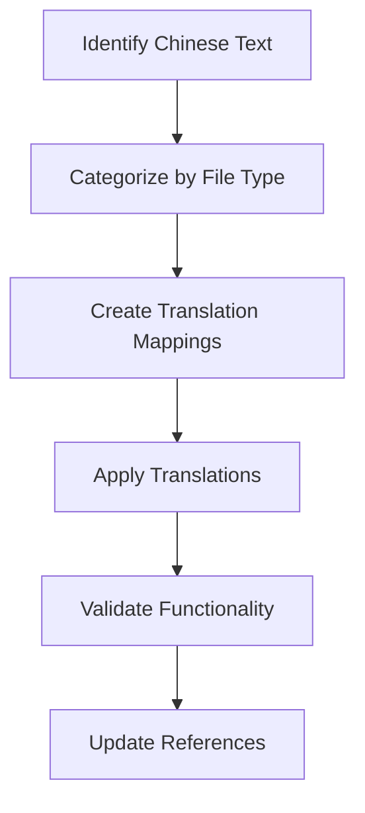

# Design Document

## Overview

The Chinese text translation feature will systematically translate all Chinese content in the xiaozhi-esp32-server project to English. Based on the analysis, the project contains Chinese text in multiple areas:

1. **Documentation files** (README.md, README_en.md)
2. **Java source code** (comments, JavaDoc)
3. **Vue.js frontend** (router comments, UI text)
4. **Internationalization files** (i18n properties files)
5. **Configuration files** (YAML, properties)
6. **Database schemas and SQL files**

The translation will maintain technical accuracy while ensuring system functionality remains intact.

## Architecture

### Translation Strategy
The translation will follow a layered approach:

1. **Static Content Layer**: Documentation, README files, and comments
2. **Application Layer**: Java source code comments and variable names
3. **Presentation Layer**: Vue.js frontend UI text and routing
4. **Data Layer**: Database schemas, SQL files, and i18n properties
5. **Configuration Layer**: YAML files and configuration comments

### Translation Workflow


## Components and Interfaces

### 1. Text Identification Component
- **Purpose**: Scan codebase for Chinese characters using regex pattern `[\u4e00-\u9fff]`
- **Input**: File paths and content
- **Output**: List of files containing Chinese text with line numbers

### 2. Translation Mapping Component
- **Purpose**: Create consistent translations for technical terms
- **Key Mappings**:
  - `设备管理` → `Device Management`
  - `用户管理` → `User Management`
  - `参数管理` → `Parameter Management`
  - `OTA管理` → `OTA Management`
  - `服务端管理` → `Server Management`
  - `固件管理` → `Firmware Management`

### 3. File Type Processors

#### Documentation Processor
- **Files**: `README.md`, `README_en.md`, `docs/**/*.md`
- **Strategy**: Full content translation maintaining markdown structure

#### Java Code Processor
- **Files**: `main/manager-api/src/**/*.java`
- **Strategy**: Translate comments and JavaDoc, preserve code functionality

#### Vue.js Processor
- **Files**: `main/manager-web/src/**/*.{vue,js}`
- **Strategy**: Translate UI strings, router titles, and comments

#### Properties Processor
- **Files**: `main/manager-api/src/main/resources/i18n/*.properties`
- **Strategy**: Update Chinese properties files and create English equivalents

#### SQL Processor
- **Files**: `main/manager-api/src/main/resources/db/**/*.sql`
- **Strategy**: Translate table comments and column descriptions

## Data Models

### Translation Entry
```typescript
interface TranslationEntry {
  filePath: string;
  lineNumber: number;
  originalText: string;
  translatedText: string;
  context: string;
  category: 'comment' | 'ui' | 'documentation' | 'configuration';
}
```

### File Processing Result
```typescript
interface ProcessingResult {
  filePath: string;
  status: 'success' | 'error' | 'skipped';
  translationsApplied: number;
  errors?: string[];
}
```

## Error Handling

### Translation Validation
- Verify that translated text maintains technical accuracy
- Ensure no breaking changes to code functionality
- Validate that UI layouts accommodate English text lengths

### File Processing Errors
- Handle encoding issues with Chinese characters
- Manage file permission errors during updates
- Provide rollback capability for failed translations

### Reference Integrity
- Ensure translated file names don't break imports
- Validate that configuration keys remain consistent
- Check that database references are maintained

## Testing Strategy

### Unit Testing
- Test individual file processors with sample Chinese content
- Validate translation mapping accuracy
- Test error handling for malformed files

### Integration Testing
- Verify that translated Java code compiles successfully
- Test that Vue.js application builds and runs correctly
- Validate that database migrations work with translated schemas

### Functional Testing
- Test complete user workflows in translated interface
- Verify API responses maintain correct structure
- Ensure device management functions work correctly

### Regression Testing
- Compare system behavior before and after translation
- Test all major features to ensure no functionality loss
- Validate that existing data remains accessible

## Implementation Phases

### Phase 1: Documentation Translation
- Translate README files and documentation
- Update image references and links
- Ensure markdown formatting is preserved

### Phase 2: Backend Translation
- Translate Java comments and JavaDoc
- Update i18n properties files
- Translate database schema comments

### Phase 3: Frontend Translation
- Translate Vue.js UI text and comments
- Update router configurations
- Ensure responsive design with English text

### Phase 4: Configuration Translation
- Translate YAML configuration comments
- Update any hardcoded Chinese strings
- Validate configuration file integrity

### Phase 5: Validation and Testing
- Run comprehensive test suite
- Perform manual testing of key features
- Document any remaining Chinese text for future updates