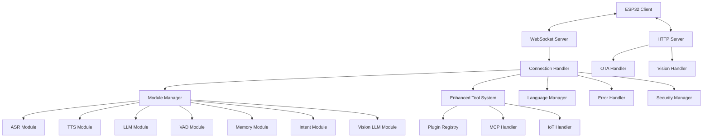
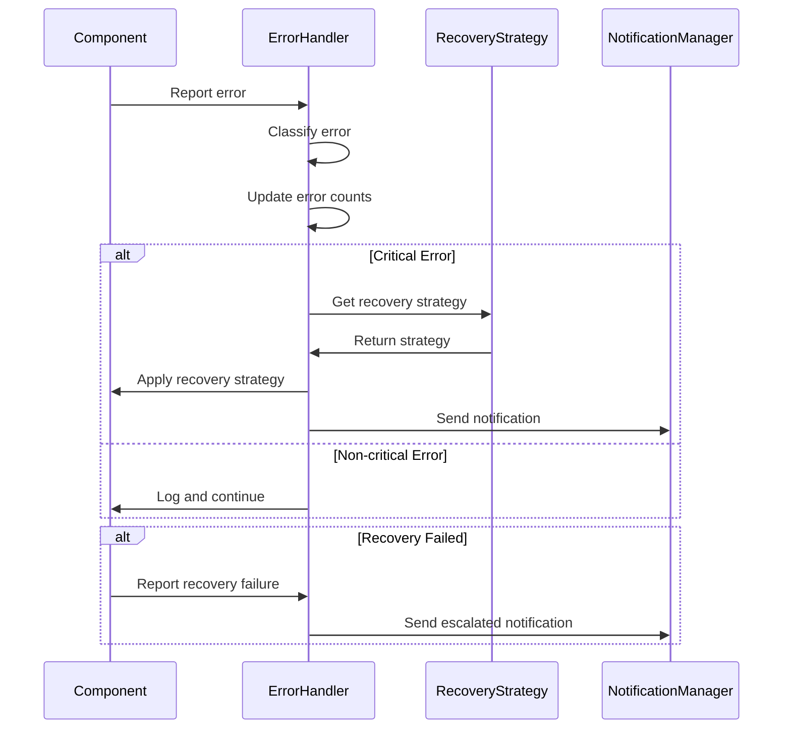

# Design Document: Xiaozhi ESP32 Server Enhancement

## Overview

This design document outlines the architecture and implementation details for enhancing the Xiaozhi ESP32 Server with multi-language support, improved tool integration, performance optimization, enhanced memory management, better error handling, and improved security features. The design builds upon the existing architecture while introducing new components and modifying existing ones to meet the requirements.

## Architecture

The enhanced Xiaozhi ESP32 Server will maintain its core architecture of a WebSocket server for real-time communication with ESP32 devices and an HTTP server for OTA updates and vision processing. The architecture will be extended with the following key components:

### High-Level Architecture



### Key Components

1. **Language Manager**: A new component responsible for managing language resources, translations, and language-specific models.
2. **Enhanced Tool System**: An improved version of the existing tool system with better discovery, registration, and error handling.
3. **Module Manager**: A refactored component that manages the initialization and lifecycle of all modules (ASR, TTS, LLM, etc.).
4. **Error Handler**: A new component for centralized error handling, logging, and recovery.
5. **Security Manager**: A new component for managing authentication, encryption, and security policies.

## Components and Interfaces

### Language Manager

The Language Manager will be responsible for managing language resources and coordinating language-specific behavior across the system.

```python
class LanguageManager:
    def __init__(self, config):
        self.config = config
        self.current_language = config.get("language", "en")
        self.available_languages = self._load_available_languages()
        self.translations = self._load_translations()
        self.language_models = {}
        
    def get_translation(self, key, language=None):
        """Get a translated string for the given key in the specified language."""
        lang = language or self.current_language
        return self.translations.get(lang, {}).get(key, self.translations.get("en", {}).get(key, key))
        
    def change_language(self, language):
        """Change the current language if it's available."""
        if language in self.available_languages:
            self.current_language = language
            return True
        return False
        
    def get_language_model(self, model_type):
        """Get the appropriate model for the current language."""
        if model_type not in self.language_models:
            self._load_language_model(model_type)
        return self.language_models.get(model_type, {}).get(self.current_language)
        
    def _load_available_languages(self):
        """Load the list of available languages."""
        # Implementation details
        
    def _load_translations(self):
        """Load translation resources for all available languages."""
        # Implementation details
        
    def _load_language_model(self, model_type):
        """Load language-specific models for the given type."""
        # Implementation details
```

### Enhanced Tool System

The Enhanced Tool System will improve upon the existing UnifiedToolHandler with better discovery, registration, and error handling.

```python
class EnhancedToolSystem:
    def __init__(self, conn):
        self.conn = conn
        self.config = conn.config
        self.logger = setup_logging()
        self.tool_manager = ToolManager(conn)
        self.executors = {}
        self.tool_cache = {}
        self.tool_stats = {}
        
    async def initialize(self):
        """Initialize the tool system and discover available tools."""
        # Register built-in executors
        self._register_built_in_executors()
        
        # Discover and register plugins
        await self._discover_plugins()
        
        # Initialize all executors
        await self._initialize_executors()
        
    async def execute_tool(self, tool_name, arguments):
        """Execute a tool with the given arguments."""
        try:
            # Find the appropriate executor
            executor = self._find_executor_for_tool(tool_name)
            if not executor:
                return ActionResponse(action=Action.NOTFOUND, response=f"Tool {tool_name} not found")
                
            # Execute the tool
            result = await executor.execute_tool(tool_name, arguments)
            
            # Update statistics
            self._update_tool_stats(tool_name)
            
            return result
        except Exception as e:
            self.logger.error(f"Error executing tool {tool_name}: {e}")
            return ActionResponse(action=Action.ERROR, response=f"Error executing tool: {str(e)}")
            
    async def reload_tool(self, tool_name):
        """Reload a specific tool."""
        # Implementation details
        
    def get_tool_info(self, tool_name):
        """Get information about a specific tool."""
        # Implementation details
        
    def get_all_tools(self):
        """Get information about all available tools."""
        # Implementation details
        
    def _register_built_in_executors(self):
        """Register built-in tool executors."""
        # Implementation details
        
    async def _discover_plugins(self):
        """Discover and register plugin tools."""
        # Implementation details
        
    async def _initialize_executors(self):
        """Initialize all registered executors."""
        # Implementation details
        
    def _find_executor_for_tool(self, tool_name):
        """Find the appropriate executor for the given tool."""
        # Implementation details
        
    def _update_tool_stats(self, tool_name):
        """Update usage statistics for the given tool."""
        # Implementation details
```

### Module Manager

The Module Manager will be responsible for initializing, configuring, and managing the lifecycle of all modules.

```python
class ModuleManager:
    def __init__(self, config, logger):
        self.config = config
        self.logger = logger
        self.modules = {}
        self.module_status = {}
        self.module_locks = {}
        
    async def initialize_modules(self):
        """Initialize all modules based on configuration."""
        # Implementation details
        
    async def get_module(self, module_type):
        """Get a module of the specified type."""
        # Implementation details
        
    async def reload_module(self, module_type):
        """Reload a specific module."""
        # Implementation details
        
    async def update_module_config(self, module_type, new_config):
        """Update the configuration for a specific module."""
        # Implementation details
        
    def get_module_status(self, module_type=None):
        """Get the status of modules."""
        # Implementation details
        
    async def _initialize_module(self, module_type):
        """Initialize a specific module."""
        # Implementation details
        
    async def _create_module_instance(self, module_type, module_config):
        """Create an instance of a module with the given configuration."""
        # Implementation details
```

### Error Handler

The Error Handler will provide centralized error handling, logging, and recovery mechanisms.

```python
class ErrorHandler:
    def __init__(self, config, logger):
        self.config = config
        self.logger = logger
        self.error_counts = {}
        self.recovery_strategies = self._load_recovery_strategies()
        self.notification_manager = NotificationManager(config)
        
    def handle_error(self, error, component=None, context=None):
        """Handle an error with the appropriate recovery strategy."""
        # Implementation details
        
    async def attempt_recovery(self, component, error_type):
        """Attempt to recover from an error."""
        # Implementation details
        
    def should_notify(self, error, component):
        """Determine if an error should trigger a notification."""
        # Implementation details
        
    def _load_recovery_strategies(self):
        """Load recovery strategies from configuration."""
        # Implementation details
        
    def _update_error_counts(self, component, error_type):
        """Update error count statistics."""
        # Implementation details
```

### Security Manager

The Security Manager will handle authentication, encryption, and security policies.

```python
class SecurityManager:
    def __init__(self, config):
        self.config = config
        self.auth_provider = self._create_auth_provider()
        self.encryption_manager = EncryptionManager(config)
        self.activity_monitor = ActivityMonitor(config)
        
    async def authenticate(self, credentials):
        """Authenticate a user or device."""
        # Implementation details
        
    def generate_token(self, identity, expiration=None):
        """Generate an authentication token."""
        # Implementation details
        
    def verify_token(self, token):
        """Verify an authentication token."""
        # Implementation details
        
    def encrypt_data(self, data, key_id=None):
        """Encrypt sensitive data."""
        # Implementation details
        
    def decrypt_data(self, encrypted_data, key_id=None):
        """Decrypt sensitive data."""
        # Implementation details
        
    async def monitor_activity(self, activity):
        """Monitor activity for suspicious patterns."""
        # Implementation details
        
    def _create_auth_provider(self):
        """Create the appropriate authentication provider based on configuration."""
        # Implementation details
```

## Data Models

### Language Resource Model

```python
class LanguageResource:
    def __init__(self, language_code, name, translations, models=None):
        self.language_code = language_code  # ISO 639-1 code
        self.name = name                    # Display name
        self.translations = translations    # Dictionary of translations
        self.models = models or {}          # Dictionary of language-specific models
        
    def to_dict(self):
        """Convert to dictionary representation."""
        return {
            "language_code": self.language_code,
            "name": self.name,
            "models": list(self.models.keys())
        }
```

### Tool Definition Model

```python
class ToolDefinition:
    def __init__(self, name, description, parameters, executor_type, version="1.0.0"):
        self.name = name                  # Tool name
        self.description = description    # Tool description
        self.parameters = parameters      # Tool parameters schema
        self.executor_type = executor_type  # Type of executor
        self.version = version            # Tool version
        
    def to_function_description(self):
        """Convert to function description format for LLM."""
        return {
            "name": self.name,
            "description": self.description,
            "parameters": self.parameters
        }
```

### Error Record Model

```python
class ErrorRecord:
    def __init__(self, error, component, context, timestamp, recovery_attempts=0):
        self.error = str(error)          # Error message
        self.error_type = type(error).__name__  # Error type
        self.component = component        # Component where the error occurred
        self.context = context            # Context information
        self.timestamp = timestamp        # When the error occurred
        self.recovery_attempts = recovery_attempts  # Number of recovery attempts
        
    def to_dict(self):
        """Convert to dictionary representation."""
        return {
            "error": self.error,
            "error_type": self.error_type,
            "component": self.component,
            "context": self.context,
            "timestamp": self.timestamp,
            "recovery_attempts": self.recovery_attempts
        }
```

## Error Handling

The enhanced system will implement a comprehensive error handling strategy:

1. **Centralized Error Handling**: All errors will be routed through the ErrorHandler for consistent handling.
2. **Error Classification**: Errors will be classified by severity and type to determine the appropriate response.
3. **Recovery Strategies**: Different recovery strategies will be implemented for different types of errors.
4. **Graceful Degradation**: When critical components fail, the system will fall back to simpler alternatives.
5. **Error Reporting**: Detailed error reports will be generated for debugging and monitoring.

### Error Recovery Flow



## Testing Strategy

The testing strategy for the enhanced system will include:

1. **Unit Tests**: For individual components and classes.
2. **Integration Tests**: For interactions between components.
3. **Performance Tests**: To verify performance requirements are met.
4. **Security Tests**: To verify security features.
5. **Internationalization Tests**: To verify multi-language support.

### Unit Testing

Unit tests will be implemented for all new components and modified existing components. Key areas for unit testing include:

- Language Manager: Test translation loading, language switching, and model selection.
- Enhanced Tool System: Test tool discovery, registration, and execution.
- Module Manager: Test module initialization, reloading, and configuration.
- Error Handler: Test error classification, recovery strategies, and notification.
- Security Manager: Test authentication, token generation/verification, and encryption/decryption.

### Integration Testing

Integration tests will verify the interactions between components, focusing on:

- Language Manager integration with ASR, TTS, and LLM modules.
- Enhanced Tool System integration with LLM for function calling.
- Error Handler integration with all components for error reporting and recovery.
- Security Manager integration with WebSocket and HTTP servers for authentication.

### Performance Testing

Performance tests will verify that the system meets the performance requirements:

- Response time tests for ASR, LLM, and TTS operations.
- Concurrent connection tests to verify scalability.
- Memory usage tests to verify efficient resource utilization.
- Stress tests to verify graceful degradation under high load.

### Security Testing

Security tests will verify the security features:

- Authentication tests to verify token-based authentication.
- Encryption tests to verify secure storage of sensitive data.
- Network security tests to verify secure communication.
- Access control tests to verify proper authorization.

### Internationalization Testing

Internationalization tests will verify multi-language support:

- Translation tests to verify all interface elements are properly translated.
- Language switching tests to verify dynamic language changes.
- Language-specific model tests to verify proper model selection based on language.
- Character encoding tests to verify proper handling of non-ASCII characters.

## Implementation Plan

The implementation will be phased to allow for incremental development and testing:

### Phase 1: Core Infrastructure

1. Implement the Module Manager for improved module lifecycle management.
2. Implement the Error Handler for centralized error handling.
3. Refactor the existing code to use these new components.

### Phase 2: Language Support

1. Implement the Language Manager.
2. Add translation resources for supported languages.
3. Integrate language-specific models for ASR, TTS, and LLM.

### Phase 3: Enhanced Tool System

1. Implement the Enhanced Tool System.
2. Refactor existing tools to use the new system.
3. Implement improved tool discovery and registration.

### Phase 4: Security Enhancements

1. Implement the Security Manager.
2. Enhance authentication and authorization.
3. Implement secure storage for sensitive data.

### Phase 5: Performance Optimization

1. Optimize memory usage in all components.
2. Implement performance monitoring.
3. Optimize critical paths for better response times.

### Phase 6: Testing and Refinement

1. Implement comprehensive test suite.
2. Conduct performance and security testing.
3. Refine based on test results.

## Deployment Considerations

The enhanced system will maintain compatibility with the existing deployment options:

1. **Docker Deployment**: The system will be deployable using Docker containers.
2. **Source Code Deployment**: The system will be deployable from source code.

Additional deployment considerations include:

1. **Migration**: A migration path will be provided for existing installations.
2. **Configuration**: Enhanced configuration options will be provided for new features.
3. **Documentation**: Comprehensive documentation will be provided for all new features.

## Conclusion

The enhanced Xiaozhi ESP32 Server will provide significant improvements in multi-language support, tool integration, performance, memory management, error handling, and security. The design builds upon the existing architecture while introducing new components and modifying existing ones to meet the requirements. The implementation plan allows for incremental development and testing, ensuring a smooth transition to the enhanced system.